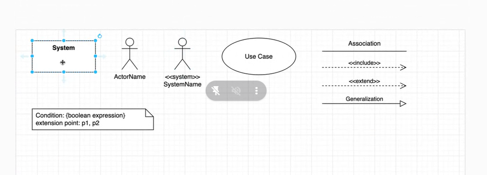

#note

4+1 architecture view model

UML diagram
    Behavior
        Use Case
        Activity
        Sequence
    Structure
        Class

Use Case

Association
include
    check out - include -> add to cart
extend
    increase number product in cart - extend -> check out (nice to have)
Generalization
---
use case
    verb
redundant use case
    log in/log out

https://github.com/200lab-Education/sa-design-system-course/blob/master/problem/web_looker_tiny_url.md