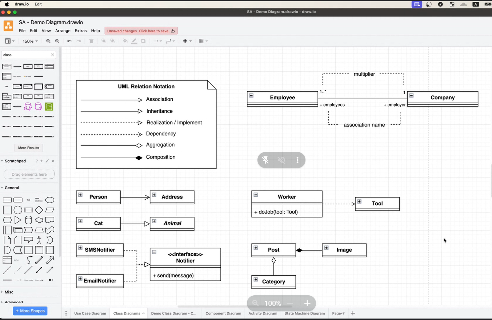
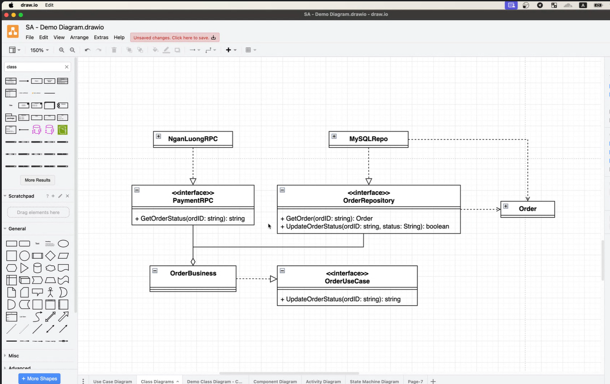
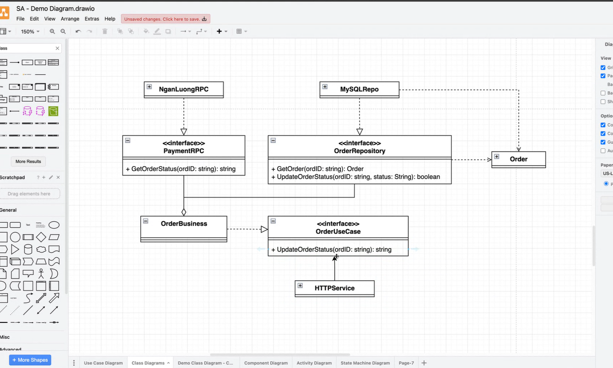
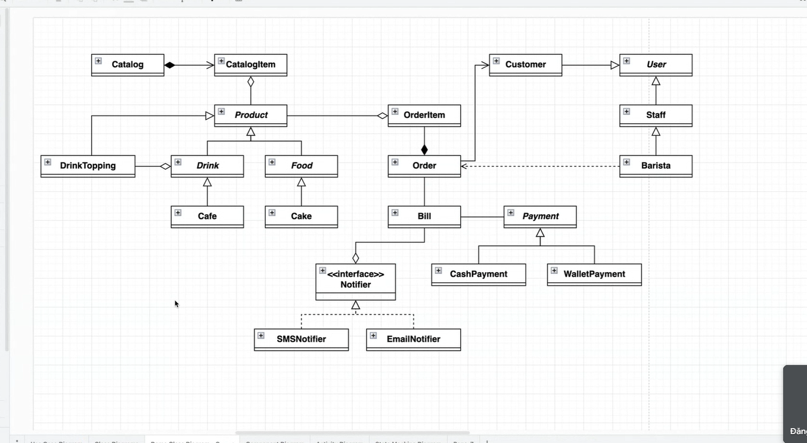
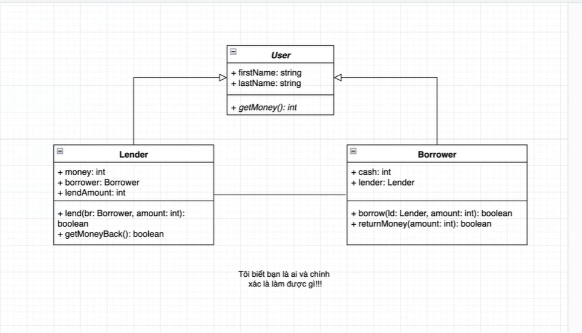
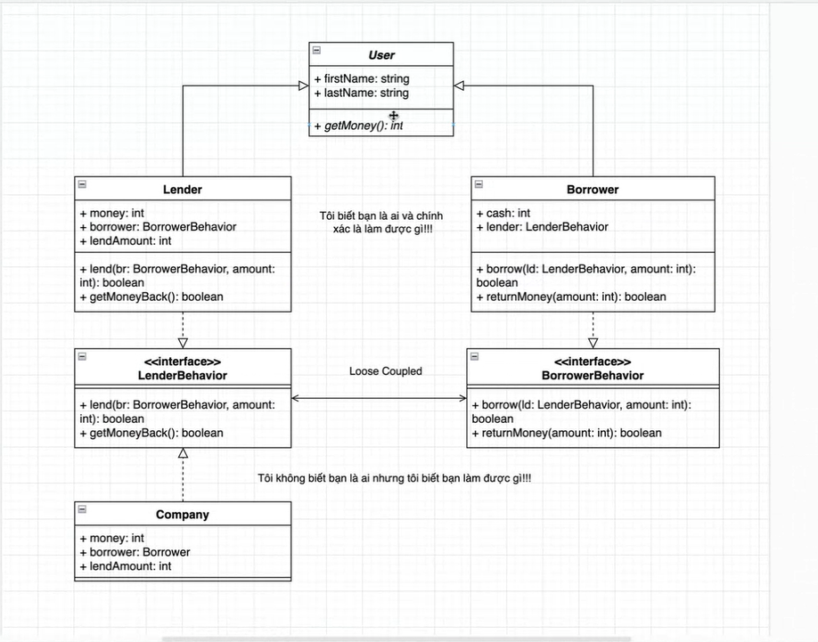

#note

Class Diagram

Association 
    Person -> Address
Inheritance
    Cat -> <<interface>> Animal
Realization / Implement
    SMSNotifier -> <<interface>> Notifier
    EmailNotifier -> <<interface>> Notifier
Dependency
    Worker -> Tool 
    Worker has doJob(tool: Tool)
Aggregation
    Category -> Post (when post is deleted, category is not deleted)
Composite
    Image -> Post (when post is deleted, image is also deleted)

Employee 1..*----1 Company

- HttpService = OrderController

OOAD
object-oriented analysis diagram

-----

https://refactoring.guru/refactoring
https://sourcemaking.com/

Head First series
    Head First Design Patterns