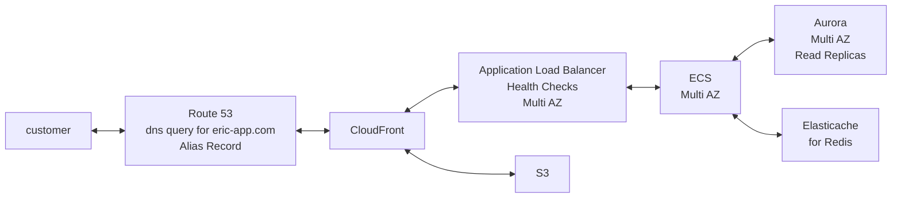
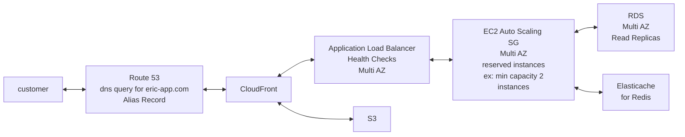

```mermaid
flowchart LR;
    customer <--> dns[Route 53 \n dns query for eric-app.com \n Alias Record];

    dns <--> cdn[CloudFront];
    cdn <--> lb[Application Load Balancer \n Health Checks \n Multi AZ];
    cdn <--> s3[S3];

    lb <--> service[ECS \n Multi AZ];

    service <--> db[Aurora \n Multi AZ \n Read Replicas];
    service <--> cache[Elasticache \n for Redis];
```

```mermaid
flowchart LR;
 
```

```mermaid
flowchart LR;
    customer <--> dns[Route 53 \n dns query for eric-app.com \n Alias Record];

    dns <--> cdn[CloudFront];
    cdn <--> lb[Application Load Balancer \n Health Checks \n Multi AZ];
    cdn <--> s3[S3];

    lb <--> service[EC2 Auto Scaling \n SG \n Multi AZ \n reserved instances \n ex: min capacity 2 instances];

    service <--> db[RDS \n Multi AZ \n Read Replicas];
    service <--> cache[Elasticache \n for Redis];
```