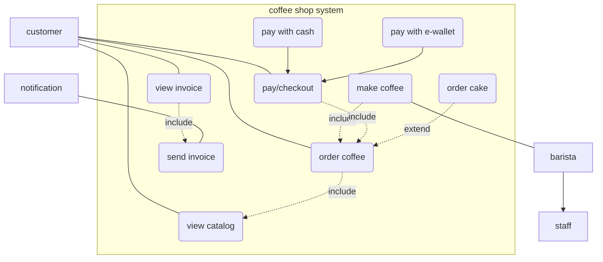

```mermaid
flowchart 
    subgraph "coffee shop system"
        order_coffee("order coffee")
        order_cake("order cake")
        view_catalog("view catalog")
        pay("pay/checkout")
        make_coffee("make coffee")
        pay_cash("pay with cash")
        pay_e_wallet("pay with e-wallet")
        view_invoice("view invoice")
        send_invoice("send invoice")
    end

    c[customer] --- order_coffee
    c --- view_catalog
    order_coffee -.->|include| view_catalog
    make_coffee -.->|include| order_coffee
    make_coffee --- b[barista]
    b -->s[staff]
    c --- view_invoice
    view_invoice -.->|include| send_invoice

    c --- pay
    pay_cash --> pay
    pay_e_wallet --> pay 
    notif["notification"] --- send_invoice 

    pay  -.->|include| order_coffee
    order_cake -.->|extend| order_coffee
```